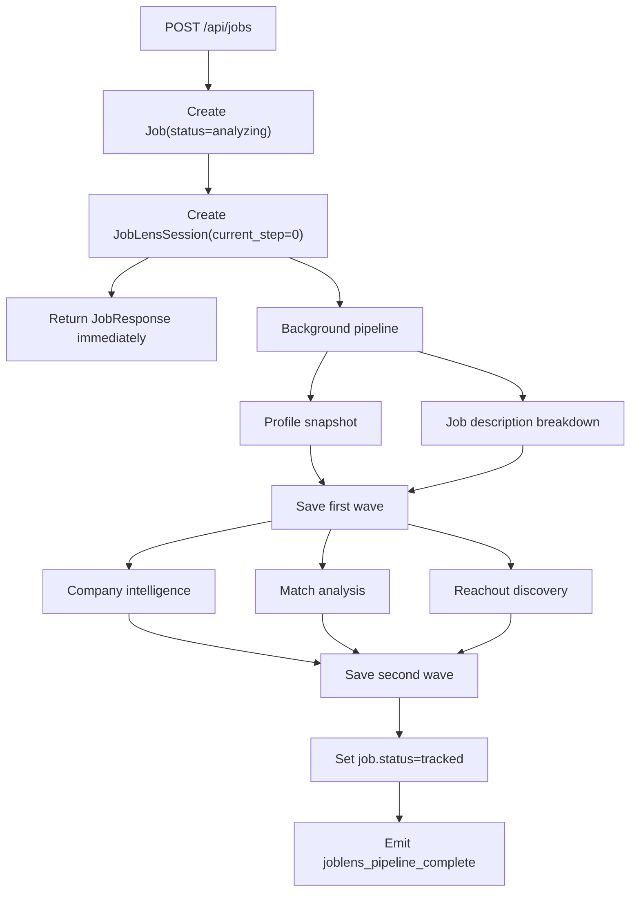

# Wand API Documentation for Frontend Planning

This document describes the current backend contract exposed by `api/main.py`, `api/routers/*`, `api/schemas.py`, and the engine Pydantic models under `engine/`. It is intended for frontend engineers planning screens, state models, realtime status, and data rendering before implementation.

## Base Contract

- Local API base URL: `http://localhost:8000`
- API docs at runtime: `GET /docs`
- JSON endpoints use `Content-Type: application/json`
- File upload endpoints use `multipart/form-data`
- Authenticated REST endpoints expect `Authorization: Bearer <jwt>`
- WebSocket endpoint uses the JWT in the path: `ws://localhost:8000/ws/{token}`
- IDs are UUID strings.
- Datetimes are ISO-like datetime strings serialized by FastAPI/Pydantic.
- Optional fields may be omitted or returned as `null`.

Open endpoints:

| Method | Path | Output |
| --- | --- | --- |
| `GET` | `/health` | `{ "status": "ok" }` |
| `GET` | `/` | `{ "message": "Wand API", "docs": "/docs" }` |
| `GET` | `/api/auth/google` | Redirect to Google OAuth |
| `GET` | `/api/auth/google/callback` | Redirect to frontend callback with `token` or `error` query param |
| `GET` | `/api/news/{company_name}` | Empty news-compatible contract; see News section |

Authenticated endpoints:

| Method | Path | Primary response model |
| --- | --- | --- |
| `GET` | `/api/auth/me` | `UserResponse` |
| `POST` | `/api/auth/logout` | `{ "message": "Logged out successfully" }` |
| `GET` | `/api/auth/profile` | `UserResponse` |
| `PATCH` | `/api/auth/profile` | `UserResponse` |
| `DELETE` | `/api/auth/profile` | `{ "message": "Account deleted successfully" }` |
| `GET` | `/api/profile` | `UserProfileResponse` |
| `POST` | `/api/profile/upload` | `ProfileFileUploadResponse` |
| `GET` | `/api/profile/files` | `ProfileFileListResponse` |
| `GET` | `/api/profile/files/{file_id}` | `ProfileFileResponse` |
| `PATCH` | `/api/profile/files/{file_id}` | `ProfileFileResponse` |
| `DELETE` | `/api/profile/files/{file_id}` | `{ "detail": "File deleted" }` |
| `GET` | `/api/profile/file/{file_id}/download` | File blob |
| `GET` | `/api/profile/file/{file_type}` | File blob, legacy |
| `POST` | `/api/profile/unified` | `UserProfileResponse` |
| `PATCH` | `/api/profile/additional-context` | `UserProfileResponse` |
| `DELETE` | `/api/profile/{file_type}` | `UserProfileResponse`, legacy |
| `POST` | `/api/jobs` | `JobResponse`; starts background JobLens pipeline |
| `GET` | `/api/jobs` | `JobListResponse[]` |
| `POST` | `/api/jobs/track` | `JobResponse`; no AI pipeline |
| `GET` | `/api/jobs/{job_id}` | `JobResponse` |
| `PATCH` | `/api/jobs/{job_id}` | `JobResponse` |
| `DELETE` | `/api/jobs/{job_id}` | `{ "message": "Job deleted" }` |
| `GET` | `/api/jobs/{job_id}/analysis` | `JobLensSessionResponse` |
| `POST` | `/api/jobs/{job_id}/parse-resume` | Parsed resume result |
| `POST` | `/api/cover-letters/analyze-jd` | `JDToneAnalysisResponse` |
| `POST` | `/api/cover-letters` | `CoverLetterResponse` |
| `GET` | `/api/cover-letters` | `CoverLetterResponse[]` |
| `GET` | `/api/cover-letters/{letter_id}` | `CoverLetterResponse` |
| `PATCH` | `/api/cover-letters/{letter_id}` | `CoverLetterResponse` |
| `DELETE` | `/api/cover-letters/{letter_id}` | `{ "message": "Cover letter deleted" }` |

## Core Enums

```ts
type JobStatus =
  | "tracked"
  | "queued"
  | "analyzing"
  | "applied"
  | "interview"
  | "offer"
  | "rejected"
  | "archived";

type CoverLetterMode =
  | "storyline"
  | "disruptive"
  | "regular"
  | "auto"
  | "custom";

type ProfileFileType = "resume" | "linkedin" | "portfolio" | "other";
```

## Auth API

### `GET /api/auth/google`

Starts OAuth and redirects to Google. The callback ultimately redirects to:

```txt
{FRONTEND_URL}/auth/callback?token=<jwt>
{FRONTEND_URL}/auth/callback?error=<message>
```

Frontend workflow:

1. Send the user to `/api/auth/google`.
2. On frontend callback, persist `token` in client storage.
3. Use `Authorization: Bearer <token>` for authenticated API calls.

### `GET /api/auth/me`

Returns the current authenticated user.

```ts
interface UserResponse {
  id: string;
  email: string;
  name: string;
  profile_picture?: string | null;
  created_at: string;
}
```

### `PATCH /api/auth/profile`

Request:

```ts
interface UserUpdate {
  name?: string | null;
  profile_picture?: string | null;
}
```

Response: `UserResponse`.

### `POST /api/auth/logout`

Server response only confirms logout. Frontend must discard the JWT.

```json
{ "message": "Logged out successfully" }
```

### `DELETE /api/auth/profile`

Deletes the current account.

```json
{ "message": "Account deleted successfully" }
```

## Profile API

Profile has two layers:

- File inventory: uploaded files, file type, parse status, and per-file context.
- Unified profile: merged renderable profile used by JobLens matching.

### `GET /api/profile`

Returns current profile status. Creates an empty profile row if none exists.

```ts
interface UserProfileResponse {
  id: string;
  user_id: string;
  resume_path?: string | null;
  linkedin_path?: string | null;
  portfolio_path?: string | null;
  resume_data?: ProfileExtractionResult | Record<string, unknown> | null;
  linkedin_data?: ProfileExtractionResult | Record<string, unknown> | null;
  portfolio_data?: ProfileExtractionResult | Record<string, unknown> | null;
  unified_profile?: UnifiedProfile | null;
  extracted_profile?: UnifiedProfile | Record<string, unknown> | null;
  additional_context?: string | null;
  updated_at: string;
}
```

Frontend display plan:

- Show `additional_context` as a global text area.
- Show legacy paths only for backwards compatibility; prefer `/api/profile/files`.
- Use `unified_profile` when present for the profile summary and JobLens readiness.

### `POST /api/profile/upload`

Uploads and parses one profile file.

Request: `multipart/form-data`

| Form field | Type | Required | Notes |
| --- | --- | --- | --- |
| `file` | File | Yes | Allowed extensions: `.pdf`, `.html`, `.htm`, `.txt`, `.doc`, `.docx`; max 10 MB |
| `type` | `ProfileFileType` | Yes | `other` is accepted |
| `additional_context` | string | No | Per-file context used during unification |

Parsing behavior:

- `resume`, `linkedin`, and `portfolio` are parsed using that source label.
- `other` PDF is parsed as `resume`.
- `other` HTML/HTM is parsed as `portfolio`.
- `other` TXT/DOC/DOCX is stored but not parsed by current source-label logic.

Response:

```ts
interface ProfileFileUploadResponse {
  id: string;
  file_type: ProfileFileType;
  filename: string;
  parsed_data?: ProfileExtractionResult | null;
}
```

Errors:

- `400` invalid `type`
- `413` file too large
- `415` unsupported extension
- `500` parsing failed

### `GET /api/profile/files`

Query params:

| Param | Type | Default | Notes |
| --- | --- | --- | --- |
| `page` | number | `1` | Minimum `1` |
| `page_size` | number | `8` | `1..50` |
| `type` | `ProfileFileType` | none | Ignored if not a valid file type |

Response:

```ts
interface ProfileFileListResponse {
  files: ProfileFileResponse[];
  total: number;
  page: number;
  page_size: number;
  total_pages: number;
}

interface ProfileFileResponse {
  id: string;
  filename: string;
  file_type: ProfileFileType;
  file_size: number;
  parsed_data?: ProfileExtractionResult | null;
  additional_context?: string | null;
  created_at: string;
  updated_at: string;
}
```

Frontend display plan:

- File rows/cards should show filename, type chip, size, parse state, additional context, created/updated timestamp.
- `parsed_data === null` means uploaded but not parsed.
- Use pagination controls from `page`, `page_size`, `total_pages`.

### `PATCH /api/profile/files/{file_id}`

Request:

```ts
interface ProfileFileUpdate {
  file_type?: ProfileFileType | null;
  additional_context?: string | null;
}
```

Response: `ProfileFileResponse`.

### `DELETE /api/profile/files/{file_id}`

Deletes DB row and disk file.

```json
{ "detail": "File deleted" }
```

### `GET /api/profile/files/{file_id}`

Response: `ProfileFileResponse`.

### `GET /api/profile/file/{file_id}/download`

Returns `application/octet-stream` file blob with download filename.

### Legacy File Endpoints

These exist for older UI paths and should not be the primary new design path.

| Method | Path | Notes |
| --- | --- | --- |
| `GET` | `/api/profile/file/{file_type}` | `file_type` must be `resume`, `linkedin`, or `portfolio`; returns blob |
| `DELETE` | `/api/profile/{file_type}` | Clears legacy path/data and deletes orphaned `ProfileFile` rows for that path |

### `POST /api/profile/unified`

Merges all parsed profile files into `unified_profile`.

Response: `UserProfileResponse`.

Workflow:

1. Collect all `ProfileFile.parsed_data` values.
2. Include global profile `additional_context`.
3. Include per-file `additional_context`.
4. Run LLM profile merge.
5. Fallback to deterministic profile creation if LLM merge fails.
6. Store both `unified_profile` and `extracted_profile`.

Frontend display plan:

- Trigger after one or more parsed files are uploaded.
- Show loading state; this request can be slow.
- On success, render `unified_profile`.
- If response lacks `unified_profile`, treat profile as incomplete.

### `PATCH /api/profile/additional-context`

Request:

```ts
interface AdditionalContextUpdate {
  additional_context: string;
}
```

Response: `UserProfileResponse`.

## Unified Profile Datatype

`unified_profile` and `profile_snapshot` are based on `engine.profile.models.UnifiedProfile`.

```ts
interface UnifiedProfile {
  basics: ProfileBasics;
  work_experience: UnifiedWorkExperienceItem[];
  skills: string[];
  education: UnifiedEducationItem[];
  dynamic_sections: Record<string, unknown>;
}

interface ProfileBasics {
  name: string;
  title?: string | null;
  summary?: string | null;
  contact_info: ContactInfo;
  location?: string | null;
}

interface ContactInfo {
  email?: string | null;
  phone?: string | null;
  linkedin_url?: string | null;
  portfolio_url?: string | null;
  github_url?: string | null;
}

interface UnifiedWorkExperienceItem {
  job_title: string;
  company_name: string;
  start_date: string;
  end_date?: string | null;
  is_current: boolean;
  location?: string | null;
  description: string[];
  achievements: string[];
}

interface UnifiedEducationItem {
  institution: string;
  degree?: string | null;
  major?: string | null;
  graduation_year?: string | null;
}
```

Frontend components:

- `ProfileHeader`: `basics.name`, `basics.title`, `basics.location`, contact links.
- `ProfileSummary`: `basics.summary`.
- `ExperienceTimeline`: `work_experience`.
- `SkillCloud` or grouped skill list: `skills`.
- `EducationList`: `education`.
- `DynamicSections`: render unknown `dynamic_sections` defensively.

## Profile Extraction Datatype

`parsed_data` from uploads is based on `engine.profile.models.ProfileExtractionResult`.

```ts
interface ProfileExtractionResult {
  documents: IngestedProfileDocument[];
  components: NormalizedProfileComponents;
  links: CapturedLink[];
  warnings: string[];
}

interface IngestedProfileDocument {
  document_id: string;
  source_type: "resume" | "cover_letter" | "linkedin" | "portfolio" | "projects" | "other";
  file_type: "pdf" | "html" | "docx" | "txt";
  metadata: DocumentMetadata;
  text_blocks: TextBlock[];
  links: CapturedLink[];
  warnings: string[];
}

interface DocumentMetadata {
  filename: string;
  content_type: string;
  extension: string;
  size_bytes: number;
  sha256: string;
  page_count?: number | null;
  paragraph_count?: number | null;
  table_count?: number | null;
  block_count?: number | null;
  link_count?: number | null;
  title?: string | null;
  duplicate_of?: string | null;
}

interface TextBlock {
  block_id: string;
  text: string;
  page_number?: number | null;
  heading_path: string[];
}

interface CapturedLink {
  link_id?: string | null;
  url: string;
  kind: "email" | "linkedin" | "github" | "portfolio" | "project" | "document" | "anchor" | "other";
  label?: string | null;
  context?: string | null;
  block_id?: string | null;
  page_number?: number | null;
  source: "text" | "pdf_embedded" | "html_href" | "docx_relationship";
  heading_path: string[];
}
```

`NormalizedProfileComponents` is the detailed extraction object. For most frontend views, display only summary counts, warnings, links, and use `/api/profile/unified` for renderable profile data.

## Jobs API

There are two create paths:

- `POST /api/jobs`: creates a job and starts the full JobLens pipeline.
- `POST /api/jobs/track`: creates a manual tracked job without AI.

### `POST /api/jobs`

Request:

```ts
interface JobCreate {
  jd_text: string;
  company_website?: string | null;
}
```

Immediate response:

```ts
interface JobResponse {
  id: string;
  job_posting: JobPostingSummary | ManualJobPosting | Record<string, unknown>;
  analysis_result?: JobAnalysisSummary | null;
  status: JobStatus;
  user_notes?: string | null;
  resume_history: ResumeHistoryResponse[];
  company_website?: string | null;
  joblens_session_id?: string | null;
  created_at: string;
  updated_at: string;
}
```

Initial returned state while background pipeline runs:

```json
{
  "job_posting": {
    "job_title": "Analyzing...",
    "company_name": "Pending",
    "raw_jd": "<first 500 chars>"
  },
  "status": "analyzing"
}
```

Frontend workflow:

1. Submit raw JD text and optional company website.
2. Navigate to job detail using returned `id`.
3. Connect WebSocket before or immediately after submit if realtime status is required.
4. Render placeholder job data while `status === "analyzing"`.
5. Listen for WebSocket events or poll `GET /api/jobs/{job_id}/analysis`.
6. Refresh `GET /api/jobs/{job_id}` when pipeline completes to get durable job summary and final score.

### `POST /api/jobs/track`

Request:

```ts
interface JobTrackCreate {
  job_title: string;
  company_name: string;
  job_url?: string | null;
  location?: string | null;
  status?: string | null;
}
```

Response: `JobResponse`.

This path does not create a JobLens session and does not run AI analysis.

### `GET /api/jobs`

Query params:

| Param | Type | Notes |
| --- | --- | --- |
| `status` | `JobStatus` | Optional filter |

Response:

```ts
interface JobListResponse {
  id: string;
  job_posting: JobPostingSummary | ManualJobPosting | Record<string, unknown>;
  status: JobStatus;
  final_score?: number | null;
  company_website?: string | null;
  joblens_session_id?: string | null;
  created_at: string;
}
```

Frontend display plan:

- Kanban/status board uses `status`.
- List card title uses `job_posting.job_title`.
- Company text uses `job_posting.company_name`.
- Match score badge uses `final_score` when present.
- Show progress state if `status === "analyzing"`.

### `GET /api/jobs/{job_id}`

Response: `JobResponse`.

Errors:

- `404` if job is not owned by current user or does not exist.

### `PATCH /api/jobs/{job_id}`

Request:

```ts
interface JobUpdate {
  status?: JobStatus | null;
  user_notes?: string | null;
  job_link?: string | null;
}
```

Behavior:

- `status` updates the job workflow status.
- `user_notes` replaces notes when provided, including empty string.
- `job_link` updates `job_posting.job_link`; empty string removes it.

Response: `JobResponse`.

### `DELETE /api/jobs/{job_id}`

Deletes job and associated JobLens sessions.

```json
{ "message": "Job deleted" }
```

### `POST /api/jobs/{job_id}/parse-resume`

Request: `multipart/form-data`

| Form field | Type | Required |
| --- | --- | --- |
| `file` | File | Yes |

Response:

```ts
interface ParseResumeForJobResponse {
  success: true;
  filename: string;
  parsed_resume: Record<string, unknown>;
}
```

This endpoint parses a resume for re-evaluation but does not currently persist the parse result to `ResumeHistory`.

## Job Posting and Analysis Datatypes

Durable job posting created by the JobLens pipeline:

```ts
interface JobPostingSummary {
  job_title: string;
  company_name: string;
  location?: string | null;
  work_mode: "remote" | "hybrid" | "onsite" | "flexible" | "unspecified";
  employment_type: "full_time" | "part_time" | "contract" | "internship" | "temporary" | "unspecified";
  seniority_level: "intern" | "entry" | "junior" | "mid" | "senior" | "staff" | "lead" | "manager" | "unspecified";
  years_of_experience_min?: number | null;
  years_of_experience_max?: number | null;
  role_family?: string | null;
  primary_track?: string | null;
  primary_skills: string[];
  secondary_skills: string[];
  responsibilities: string[];
  constraints: string[];
  keywords: string[];
  job_link?: string;
}

interface ManualJobPosting {
  job_title: string;
  company_name: string;
  job_link?: string;
  location?: string;
}
```

Durable analysis summary stored on `Job.analysis_result`:

```ts
interface JobAnalysisSummary {
  final_score: number;
  match_band: "strong" | "good" | "partial" | "weak";
  headline: string;
  strongest_matches: string[];
  biggest_gaps: string[];
}
```

Resume history:

```ts
interface ResumeHistoryResponse {
  version: number;
  resume_data: Record<string, unknown>;
  score?: number | null;
  created_at: string;
}
```

## JobLens Analysis API

### `GET /api/jobs/{job_id}/analysis`

Returns the full analysis session linked to a job.

```ts
interface JobLensSessionResponse {
  id: string;
  job_id?: string | null;
  profile_snapshot?: UnifiedProfile | null;
  job_description?: JobDescriptionBreakdownResult | null;
  company_intel?: CompanyIntelResult | null;
  match_analysis?: JobMatchResult | null;
  reachout?: ReachoutResult | null;
  raw_jd_text?: string | null;
  company_website?: string | null;
  current_step: number;
  created_at: string;
  updated_at: string;
}
```

`current_step` mapping:

| Step | Meaning | Data field |
| --- | --- | --- |
| `0` | Session created, no completed module persisted | none |
| `1` | Profile snapshot completed | `profile_snapshot` |
| `2` | Job description breakdown completed | `job_description` |
| `3` | Company intelligence completed | `company_intel` |
| `4` | Match analysis completed | `match_analysis` |
| `5` | Reachout discovery completed | `reachout` |

Because later modules run in parallel, `current_step` is a coarse persisted maximum, not a strict frontend progress sequence. Prefer checking individual nullable fields and WebSocket events.

## JobLens Background Workflow

One `POST /api/jobs` call starts a continuous background workflow with parallel sections.



Parallel intended workflow:

- First wave runs `profile` and `job_description` concurrently.
- Second wave runs `company_intel`, `match_analysis`, and `reachout` concurrently after job description exists.
- Each module emits started, complete, or failed WebSocket events independently.
- A module failure does not necessarily fail the whole job. Completed module data is still saved.

Continuous workflow:

- `POST /api/jobs` is non-blocking from the frontend perspective.
- The initial job exists immediately and can be displayed.
- The job detail view should progressively fill sections as WebSocket events arrive.
- Polling fallback: call `GET /api/jobs/{job_id}/analysis` every few seconds until enough fields are present or the job status changes from `analyzing`.

## JobLens Engine Datatypes

### Job Description Breakdown

`job_description` is based on `engine.joblens.job_description.models.JobDescriptionBreakdownResult`.

```ts
interface JobDescriptionBreakdownResult {
  input: {
    text: string;
    source_id?: string | null;
  };
  breakdown: {
    metadata: JobMetadata;
    company_context: CompanyContext;
    role_classification: RoleClassification;
    primary_skills: SkillRequirement[];
    secondary_skills: SkillRequirement[];
    responsibilities: ResponsibilityRequirement[];
    qualifications: QualificationRequirement[];
    constraints: JobConstraint[];
    keywords: string[];
    extraction_notes: string[];
  };
  warnings: string[];
}

interface JobMetadata {
  job_title?: string | null;
  company_name?: string | null;
  location?: string | null;
  work_mode: "remote" | "hybrid" | "onsite" | "flexible" | "unspecified";
  employment_type: "full_time" | "part_time" | "contract" | "internship" | "temporary" | "unspecified";
  seniority_level: "intern" | "entry" | "junior" | "mid" | "senior" | "staff" | "lead" | "manager" | "unspecified";
  years_of_experience_min?: number | null;
  years_of_experience_max?: number | null;
  posted_at?: string | null;
  apply_by?: string | null;
  source_phrases: string[];
}

interface SkillRequirement {
  name: string;
  category:
    | "language"
    | "frontend"
    | "backend"
    | "framework"
    | "database"
    | "cloud"
    | "infrastructure"
    | "devops"
    | "data"
    | "ai_ml"
    | "security"
    | "testing"
    | "api"
    | "visualization"
    | "functional"
    | "domain"
    | "soft_skill"
    | "other";
  required_level: "basic" | "working" | "strong" | "expert" | "unspecified";
  required_years?: number | null;
  importance: "must_have" | "important" | "nice_to_have" | "context";
  is_must_have: boolean;
  source_phrases: string[];
}

interface ResponsibilityRequirement {
  action: string;
  object: string;
  context?: string | null;
  importance: "must_have" | "important" | "nice_to_have" | "context";
  source_phrases: string[];
}

interface QualificationRequirement {
  text: string;
  category: string;
  importance: "must_have" | "important" | "nice_to_have" | "context";
  is_must_have: boolean;
  source_phrases: string[];
}

interface JobConstraint {
  category:
    | "location"
    | "work_authorization"
    | "education"
    | "compensation"
    | "employment_type"
    | "clearance"
    | "other";
  text: string;
  importance: "must_have" | "important" | "nice_to_have" | "context";
  is_must_have: boolean;
  source_phrases: string[];
}
```

Recommended frontend sections:

- Job facts: `metadata`.
- Company context: `company_context`.
- Skills matrix: `primary_skills`, `secondary_skills`.
- Responsibilities list: `responsibilities`.
- Requirements and constraints: `qualifications`, `constraints`.
- Source transparency: `source_phrases`, `warnings`.

### Company Intelligence

`company_intel` is based on `engine.joblens.company_intel.models.CompanyIntelResult`.

```ts
interface CompanyIntelResult {
  input: {
    company_name?: string | null;
    website?: string | null;
    max_pages: number;
    include_engineering_posts: boolean;
  };
  identity: CompanyIdentity;
  product_signals: ProductSignal[];
  engineering_presence: EngineeringPresence;
  technical_signals: TechnicalSignals;
  engineering_culture: EngineeringCultureSignals;
  hiring_signals: HiringSignals;
  source_pages: FetchedCompanyPage[];
  extraction_notes: string[];
  warnings: string[];
}
```

Frontend display plan:

- Company header: `identity.name`, `identity.website`, `identity.short_description`, `identity.industry`.
- Product context: `product_signals`.
- Engineering preview: `engineering_presence.recent_posts`, `primary_engineering_topics`.
- Tech stack chips: `technical_signals` grouped lists.
- Culture and hiring tabs: `engineering_culture`, `hiring_signals`.
- Source drawer: `source_pages`, nested `evidence`.

### Match Analysis

`match_analysis` is based on `engine.joblens.job_match.models.JobMatchResult`.

```ts
interface JobMatchResult {
  job_title?: string | null;
  company_name?: string | null;
  role_family?: string | null;
  summary: JobMatchSummary;
  score_components: ScoreComponent[];
  constraints: ConstraintMatch[];
  skill_matches: SkillMatch[];
  responsibility_matches: ResponsibilityMatch[];
  domain_matches: DomainMatch[];
  update_actions: ResumeAction[];
  replace_actions: ResumeAction[];
  delete_actions: ResumeAction[];
  selected_actions: ResumeAction[];
  warnings: string[];
}

interface JobMatchSummary {
  total_score: number;
  match_band: "strong" | "good" | "partial" | "weak";
  headline: string;
  strongest_matches: string[];
  biggest_gaps: string[];
  hard_constraint_summary?: string | null;
}

interface ScoreComponent {
  name: string;
  score: number;
  max_score: number;
  rationale?: string | null;
}

interface EvidenceItem {
  profile_field: string;
  text: string;
  evidence_type: string;
  strength: number; // 0..5
  explanation?: string | null;
}

interface SkillMatch {
  jd_skill: string;
  normalized_skill?: string | null;
  category: string;
  importance: "must_have" | "important" | "nice_to_have" | "context";
  match_level: "exact" | "alias" | "adjacent" | "transferable" | "missing" | "unknown";
  score: number;
  max_score: number;
  profile_evidence: EvidenceItem[];
  gap?: string | null;
  action_hint?: string | null;
}

interface ResumeAction {
  action_type: "update" | "replace" | "delete";
  priority: "high" | "medium" | "low";
  target_section: string;
  target_text?: string | null;
  suggested_text?: string | null;
  reason: string;
  jd_alignment: string[];
  profile_evidence: EvidenceItem[];
  expected_score_impact?: string | null;
}
```

Frontend display plan:

- Score hero: `summary.total_score`, `summary.match_band`, `summary.headline`.
- Score breakdown: `score_components`.
- Evidence drilldown: `skill_matches`, `responsibility_matches`, `domain_matches`.
- Constraint risk area: `constraints`.
- Resume action queue: `update_actions`, `replace_actions`, `delete_actions`, `selected_actions`.

### Reachout

`reachout` is based on `engine.joblens.reachout.models.ReachoutResult`.

```ts
interface ReachoutResult {
  input: ReachoutInput;
  search_plan: ReachoutSearchPlan;
  raw_results: SearchResult[];
  pre_gated_results: GatedSearchResult[];
  candidates: ReachoutCandidate[];
  rejected_results: RejectedReachoutResult[];
  warnings: string[];
}

interface ReachoutCandidate {
  source_result_id?: string | null;
  full_name: string;
  current_title?: string | null;
  company?: string | null;
  profile_url: string;
  profile_source: "linkedin" | "company_page" | "github" | "personal_site" | "other";
  likely_persona:
    | "recruiter"
    | "technical_recruiter"
    | "talent_acquisition"
    | "engineering_leader"
    | "hiring_manager"
    | "senior_management"
    | "peer_engineer"
    | "school_alumni"
    | "founder"
    | "other";
  confidence: number;
  confidence_band: "high" | "medium" | "low";
  confidence_reasons: string[];
  matched_query: string;
  source_title: string;
  source_snippet?: string | null;
  gating_notes: string[];
}
```

Frontend display plan:

- Contact cards: `candidates`.
- Search transparency: `search_plan.queries`, `raw_results`, `pre_gated_results`.
- Rejection debug view for internal QA: `rejected_results`.

## WebSocket API

Connect:

```txt
ws://localhost:8000/ws/{token}
```

Initial message:

```ts
interface WebSocketConnectedEvent {
  type: "connected";
  message: "Connected to job updates";
}
```

Ping/pong:

- Client sends text `ping`.
- Server replies text `pong`.

JobLens event base:

```ts
type JobLensStep =
  | "profile"
  | "job_description"
  | "company_intel"
  | "match_analysis"
  | "reachout"
  | "pipeline";

type JobLensEventType =
  | "joblens_step_started"
  | "joblens_step_complete"
  | "joblens_step_failed"
  | "joblens_pipeline_complete"
  | "joblens_pipeline_failed";

interface JobLensWebSocketEvent {
  type: JobLensEventType;
  session_id: string;
  job_id?: string | null;
  step: JobLensStep;
  data?: unknown;
  error?: string;
}
```

Event examples:

```json
{
  "type": "joblens_step_started",
  "session_id": "session-uuid",
  "job_id": "job-uuid",
  "step": "job_description"
}
```

```json
{
  "type": "joblens_step_complete",
  "session_id": "session-uuid",
  "job_id": "job-uuid",
  "step": "match_analysis",
  "data": {
    "summary": {
      "total_score": 82,
      "match_band": "good",
      "headline": "Strong backend match with some frontend gaps"
    }
  }
}
```

Frontend state handling:

- Maintain state by `session_id`.
- For `joblens_step_started`, mark that section loading.
- For `joblens_step_complete`, store `data` under the matching section and clear loading/error.
- For `joblens_step_failed`, store an error on that section but keep other sections active.
- For `joblens_pipeline_complete`, refresh job and session via REST.
- For `joblens_pipeline_failed`, show pipeline-level error and refresh REST state.

## Cover Letter API

### `POST /api/cover-letters/analyze-jd`

Request uses `CoverLetterCreate`; only `job_id` or `jd_text` is required for analysis.

```ts
interface CoverLetterCreate {
  job_id?: string | null;
  mode?: CoverLetterMode;
  custom_prompt?: string | null;
  include_news?: boolean;
  jd_text?: string | null;
  company_name?: string | null;
}
```

Response:

```ts
interface JDToneAnalysisResponse {
  recommended_mode: string;
  confidence: number; // 0..1
  tone_signals: string[];
  culture_indicators: string[];
  formality_level: string;
  industry: string;
  reasoning: string;
}
```

### `POST /api/cover-letters`

Generates and stores a cover letter.

Request:

```ts
interface CoverLetterCreate {
  job_id?: string | null;
  mode?: CoverLetterMode;
  custom_prompt?: string | null;
  include_news?: boolean;
  jd_text?: string | null;
  company_name?: string | null;
}
```

Rules:

- Provide `job_id` to generate from an existing job.
- Or provide `jd_text` for quick generation.
- If `include_news` is true and company name exists, company intelligence is collected and passed into generation.
- If neither `job_id` nor `jd_text` resolves to a job posting, backend returns `400`.

Response:

```ts
interface CoverLetterResponse {
  id: string;
  job_id?: string | null;
  mode: string;
  content: CoverLetterContent;
  created_at: string;
  updated_at: string;
}

interface CoverLetterContent {
  mode: string;
  mode_label: string;
  jd_tone_detected?: string | null;
  enhanced_prompt?: string | null;
  company_intel_used: boolean;
  greeting: string;
  body_paragraphs: string[];
  closing_paragraph: string;
  sign_off: string;
  full_letter: string;
  job_title?: string;
  company_name?: string;
}
```

### `GET /api/cover-letters`

Response: `CoverLetterResponse[]`, sorted by `updated_at` descending.

### `GET /api/cover-letters/{letter_id}`

Response: `CoverLetterResponse`.

### `PATCH /api/cover-letters/{letter_id}`

Request:

```ts
interface CoverLetterUpdate {
  full_letter?: string | null;
  content?: Partial<CoverLetterContent> | Record<string, unknown> | null;
}
```

Behavior:

- `full_letter` updates `content.full_letter`.
- `content` shallow-merges into existing `content`.

Response: `CoverLetterResponse`.

### `DELETE /api/cover-letters/{letter_id}`

```json
{ "message": "Cover letter deleted" }
```

## News API

### `GET /api/news/{company_name}?num_articles=5`

Current behavior intentionally returns an empty contract because company context moved into JobLens company intelligence.

Query params:

| Param | Type | Default | Max |
| --- | --- | --- | --- |
| `num_articles` | number | `5` | `20` |

Response:

```ts
interface NewsResponse {
  company_name: string;
  articles: NewsArticleResponse[];
  total_results: number;
}

interface NewsArticleResponse {
  title: string;
  description: string;
  url: string;
  source: string;
  published_at: string;
}
```

Actual current response:

```json
{
  "company_name": "Acme",
  "articles": [],
  "total_results": 0
}
```

Frontend guidance:

- Do not plan a separate news-heavy view from this endpoint.
- Use `company_intel` under JobLens for company research UI.

## Recommended Frontend Data Model

Use these primary client-side stores:

| Store | Source APIs | Notes |
| --- | --- | --- |
| `auth.user` | `/api/auth/me`, `/api/auth/profile` | JWT controls session |
| `profile.files` | `/api/profile/files` | Paginated inventory |
| `profile.unified` | `/api/profile`, `/api/profile/unified` | Renderable candidate profile |
| `jobs.list` | `/api/jobs` | Board/list data |
| `jobs.byId[jobId]` | `/api/jobs/{job_id}` | Full job record |
| `joblens.bySessionId[sessionId]` | WebSocket, `/api/jobs/{job_id}/analysis` | Progressive analysis sections |
| `coverLetters.list` | `/api/cover-letters` | Saved letters |
| `coverLetters.byId[id]` | `/api/cover-letters/{letter_id}` | Editor/detail |

## Recommended Screen Workflows

### Profile Setup Continuous Workflow

1. Load `GET /api/profile`.
2. Load `GET /api/profile/files`.
3. Upload one or more files with `POST /api/profile/upload`.
4. Let users edit each file's `file_type` and `additional_context`.
5. Save global context through `PATCH /api/profile/additional-context`.
6. Generate unified profile with `POST /api/profile/unified`.
7. Render `unified_profile`; show warnings/counts from file `parsed_data`.

### JobLens Continuous Workflow

1. Ensure a `unified_profile` exists or warn that matching quality will be lower.
2. Connect WebSocket.
3. Submit `POST /api/jobs`.
4. Show job placeholder immediately.
5. Render section loading states for:
   - profile
   - job description
   - company intel
   - match analysis
   - reachout
6. Fill each section as WebSocket `joblens_step_complete` arrives.
7. On pipeline complete, refresh `GET /api/jobs/{job_id}` and `GET /api/jobs/{job_id}/analysis`.

### Manual Tracking Workflow

1. Submit `POST /api/jobs/track`.
2. Render on board/list immediately.
3. Allow `PATCH /api/jobs/{job_id}` for status, notes, and job link.
4. No JobLens session is expected unless the user later creates an analyzed job separately.

### Cover Letter Workflow

1. For saved job: call `POST /api/cover-letters/analyze-jd` with `job_id` to suggest mode.
2. Let user choose mode and optional custom prompt.
3. Call `POST /api/cover-letters`.
4. Render `content.full_letter` in editor.
5. Save edits with `PATCH /api/cover-letters/{letter_id}`.

### Quick Cover Letter Workflow

1. User pastes `jd_text` and optional `company_name`.
2. Optional tone analysis with `/api/cover-letters/analyze-jd`.
3. Generate via `POST /api/cover-letters` without `job_id`.
4. Store result as a cover letter with `job_id: null`.

## Frontend Rendering Datatypes

| UI Element | Backend datatype | Render as |
| --- | --- | --- |
| Job status | `JobStatus` enum | Select, Kanban column, badge |
| Match score | number `0..100` | Progress ring/bar, score badge |
| Match band | `"strong" | "good" | "partial" | "weak"` | Color-coded badge |
| Confidence | number `0..1` | Percent badge/bar |
| Evidence strength | integer `0..5` | Dots/stars/segmented meter |
| Datetime | string | Relative time plus tooltip with absolute time |
| UUID | string | Internal key; truncate only if shown |
| URLs | string | External link with safe target |
| Source phrases | `string[]` | Expandable evidence list |
| Warnings | `string[]` | Inline non-blocking alert list |
| Uploaded file size | number bytes | Human-readable KB/MB |
| `parsed_data` | `ProfileExtractionResult | null` | Parsed status, warnings, links, details drawer |
| `unified_profile` | `UnifiedProfile | null` | Profile page sections |
| `job_description` | `JobDescriptionBreakdownResult | null` | JD analysis tabs |
| `company_intel` | `CompanyIntelResult | null` | Company research tabs |
| `match_analysis` | `JobMatchResult | null` | Score, evidence, actions |
| `reachout` | `ReachoutResult | null` | Contact cards and search trace |

## Error Handling Expectations

Common error response shape:

```ts
interface ApiError {
  detail: string | unknown;
}
```

Frontend should handle:

- `401` / invalid token: clear token and route to login.
- `400`: validation or missing required business input.
- `404`: show not found state; for job detail, allow returning to list.
- `413`: file too large.
- `415`: unsupported file type.
- `500`: parsing or LLM orchestration failure; show retry guidance.

## Implementation Notes for Frontend Engineers

- Treat `JobResponse.job_posting` as a union. It can be placeholder, manual tracked job data, or full JobLens summary.
- Treat `JobLensSessionResponse` section fields as independently nullable because the pipeline is parallel and partial success is allowed.
- Prefer WebSocket for live progress, but implement REST polling fallback for page reloads and reconnects.
- Use `GET /api/jobs/{job_id}/analysis` as the canonical full analysis payload after initial creation.
- Use `GET /api/jobs/{job_id}` as the canonical durable job card/detail summary.
- For new profile UI, prefer multi-file endpoints under `/api/profile/files`; keep legacy file endpoints only for compatibility.
- `GET /api/news/{company_name}` currently returns no articles by design; company research should come from `company_intel`.
- For file upload with `FormData`, do not manually set `Content-Type`; let the browser include the multipart boundary.
